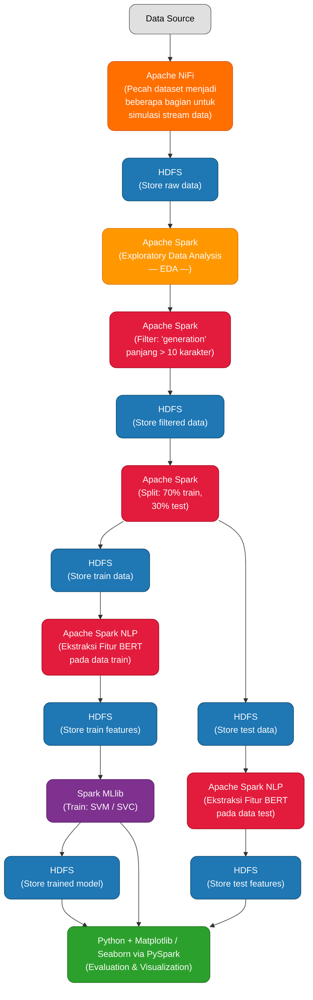

| Komponen                 | URL Akses                                      | Fungsi                                             |
| ------------------------ | ---------------------------------------------- | -------------------------------------------------- |
| **Hadoop NameNode**      | [http://localhost:9870](http://localhost:9870) | Monitoring HDFS (lihat file yang diupload ke HDFS) |
| **YARN ResourceManager** | [http://localhost:8088](http://localhost:8088) | Melihat job Spark yang sedang jalan                |
| **Spark Master**         | [http://localhost:8080](http://localhost:8080) | Dashboard cluster Spark                            |
| **NiFi**                 | [http://localhost:8081/nifi/](http://localhost:8081/nifi/) | Data ingestion pipeline                            |
| **Jupyter Notebook**     | [http://localhost:8888](http://localhost:8888) | Analisis dan model machine learning                |

